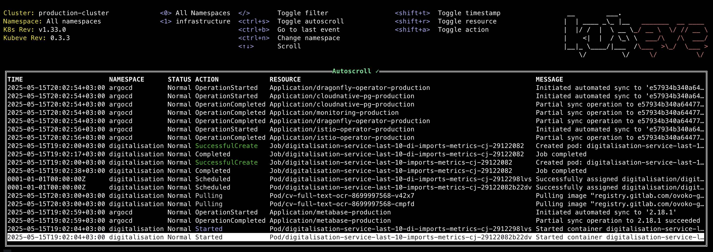

# `kubeve`: Human way to look into Kubernetes Events

## What is `kubeve`?

**kubeve** is a tool to for reading Kubernetes events in human way 

## Installation
### Brew
`brew tap a0xAi/kubeve` 
`brew install kubeve`